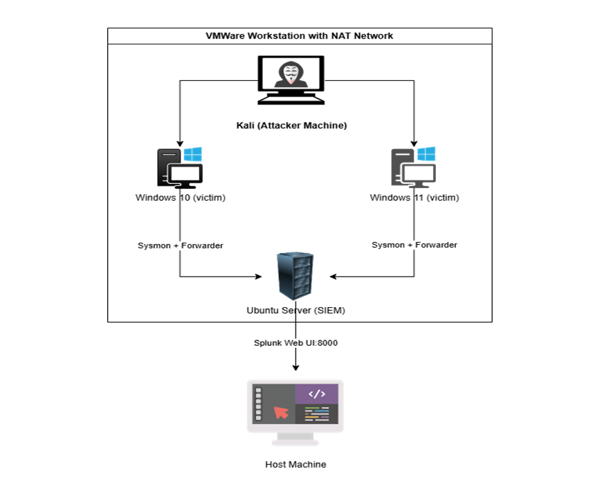

# 🛡️ Home SOC Lab - Attack Detection & Analysis

> A hands-on Security Operations Centre (SOC) home lab built to simulate real-world attacks, capture telemetry, and develop detection engineering skills using **Splunk**, **Sysmon**, and the **MITRE ATT&CK** framework.

---

## 📝 About This Project

This lab was built to gain practical experience in:
- Setting up a SIEM (Splunk) in a virtualised environment
- Simulating offensive attacks using Kali Linux
- Capturing and analysing Windows Security and Sysmon logs
- Writing SPL (Search Processing Language) detection queries
- Documenting findings in a SOC analyst report format aligned to the **Cyber Kill Chain**

Every attack scenario includes a full walkthrough - attacker commands, generated Event IDs, Splunk detection queries, severity rating, and analyst response actions.
---

## 📌 Requirements 
Ensure you have the following components prepared before beginning the SOC home lab setup:


| Componants | Description |
|---|---|
|RAM |At least 16 GB is Recommended for Multiple VMS|
|virtualization Software | Virtual Box or VMWare workstation to create a multile VMS |
|ISOs | Kali linux, Window 10 and 11, Ubuntu server from offical pages|
|Security Tools | Splunk Enterprises,Universal Forwarder and sysmon for log collection and analysis|
---

## 🖥️ Lab Architecture


---

## 🧰 Tools & Technologies

| Category | Tool | Purpose |
|---|---|---|
| SIEM | Splunk Enterprise | Log ingestion, indexing, detection queries |
| Log Agent | Splunk Universal Forwarder | Forwards Windows logs to Splunk |
| Telemetry | Sysmon (System Monitor) | Process, file, network, registry events |
| Attacker | Kali Linux | Attack simulation platform |
| Brute Force | Hydra / Crowbar | RDP credential brute forcing |
| Payload | msfvenom | Reverse TCP Meterpreter payload generation |
| C2 Framework | Metasploit (multi/handler) | Command & Control listener |
| Remote Access | xfreerdp | RDP client from Kali |
| Virtualisation | VMWare | Host all lab machines |
| Framework | MITRE ATT&CK | Technique mapping & categorisation |
| Framework | Cyber Kill Chain | Attack phase structuring |
---

## 📄 Documentation

| Document | Description | Link |
|---|---|---|
| VM Installation Guide | Step-by-step setup for VMWare, Ubuntu Server, Windows 10, and Kali Linux VMs | [View →](docs/vmmachinesInstallation.docx) |
| Splunk Setup Guide | Installing Splunk Enterprise, Universal Forwarder, Sysmon, and verifying log ingestion | [View →](docs/splunkInstallation.md) |

---

## ⚔️ Attack Scenarios

| # | Attack | Tools Used | Kill Chain Coverage | MITRE ATT&CK | Format | Link |
|---|---|---|---|---|---|---|
| 1 | RDP Brute Force + Create New accout | nmap,Hydra, xfreerdp |  ___ | T1110.001, T1136.001 | Summary | [View →](scenarios/scenario1.md) |
| 2 | RDP Brute Force + Meterpreter Backdoor & Persistence | Hydra, msfvenom, Metasploit | All 7 Phases | T1110.001, T1547.001, T1053.005, T1571 | Cyber Kill Chain (Stage-by-Stage) | [View →](scenarios/scenario2.md) |

---

## 🔍 Detection Coverage

Detections are written in **SPL (Splunk Search Processing Language)** and validated against live log data captured in the lab.

| Detection | Event Source | Event ID | Technique |
|---|---|---|---|
| RDP Brute Force — Multiple Failed Logons | Windows Security | 4625 | T1110.001 |
| Successful RDP Login After Brute Force | Windows Security | 4624 | T1078 |
| Executable Dropped to Temp/AppData | Sysmon | 11 | T1204.002 |
| Malicious Process Spawned from Temp | Sysmon | 1 | T1204.002 |
| Reverse TCP C2 Callback (Port 4444) | Sysmon | 3 | T1571 |
| Registry Run Key Persistence | Sysmon | 13 | T1547.001 |
| Scheduled Task with Payload | Windows Security | 4698 | T1053.005 |
| Privilege Escalation to SYSTEM | Windows Security | 4672 | T1068 |

---

## ⚙️ Configuration Files

| File | Description | Link |
|---|---|---|
| `sysmonconfig-export.xml` | Sysmon configuration — defines which events to log (process creation, network, registry, file) | [View →](https://github.com/SwiftOnSecurity/sysmon-config/blob/master/sysmonconfig-export.xml) |
| `inputs.conf` | Splunk Universal Forwarder config — defines which Windows Event logs to forward to Splunk | [View →](config/inputs.conf) |

**Key log sources enabled in `inputs.conf`:**
```ini
[WinEventLog://Security]
disabled = 0
index = windows_logs

[WinEventLog://System]
disabled = 0
index = windows_logs

[WinEventLog://Application]
disabled = 0
index = windows_logs

[WinEventLog://Microsoft-Windows-Sysmon/Operational]
disabled = 0
index = windows_logs
renderXml = true
```

---

## 🚀 How to Replicate This Lab

1. **Set up virtual machines** → Follow [VM Installation Guide](docs/vmmachinesInstallation.doc)
2. **Install and configure Splunk** → Follow [Splunk Setup Guide](docs/splunkinstallation.md)
3. **Deploy Sysmon on Windows victim** using [sysmonconfig-export.xml](config/sysmonconfig-export.xml)
4. **Configure Splunk Forwarder** using [inputs.conf](config/inputs.conf)
5. **Run an attack scenario** → Start with [Scenario 2](scenarios/scenario2.md) (full Cyber Kill Chain walkthrough)
6. **Verify logs in Splunk WebUI** → Run the SPL detection queries from the scenario doc

---

## 📊 Lab Progress

| Milestone | Status |
|---|---|
| VMWare + VM setup (Kali, Windows 10 or 11, Ubuntu Server) | ✅ Complete |
| Network configuration (NAT Adapter) | ✅ Complete |
| Splunk Enterprise installed on Ubuntu Server | ✅ Complete |
| Splunk Universal Forwarder installed on Windows 10 | ✅ Complete |
| Sysmon deployed and configured on Windows 10 | ✅ Complete |
| Log ingestion verified in Splunk WebUI | ✅ Complete |
| Scenario 1 - RDP Brute Force + Backdoor Persistence | ✅ Complete |
| Scenario 2 - SSH Brute Force + Reverse Shell | 🔄 In Progress |
| Scenario 3 - Mimikatz Credential Dumping | 🔲 Planned |
| Scenario 4 - PsExec Lateral Movement | 🔲 Planned |
| Scenario 5 - PowerShell Fileless Malware | 🔲 Planned |
| Pfsense firewall configuration in VMWare | 🔲 Planned |


---

## 📚 References

- [MITRE ATT&CK Framework](https://attack.mitre.org/)
- [Lockheed Martin Cyber Kill Chain](https://www.lockheedmartin.com/en-us/capabilities/cyber/cyber-kill-chain.html)
- [Splunk SPL Documentation](https://docs.splunk.com/Documentation/Splunk/latest/SearchReference/WhatsInThisManual)
- [Sysmon Documentation](https://learn.microsoft.com/en-us/sysinternals/downloads/sysmon)
- [SwiftOnSecurity Sysmon Config](https://github.com/SwiftOnSecurity/sysmon-config)

---

## 👤 Author

**ESAKKIRAJ**
Aspiring SOC Analyst | Security enthusiast building hands-on detection engineering skills

[](https://linkedin.com/in/esakkiraj03)
[](https://github.com/esakki-raj-cybersec)

---

> ⚠️ **Disclaimer:** All attacks documented here were performed in an isolated, offline virtualised lab environment. No real systems were targeted. This project is for educational and portfolio purposes only.
