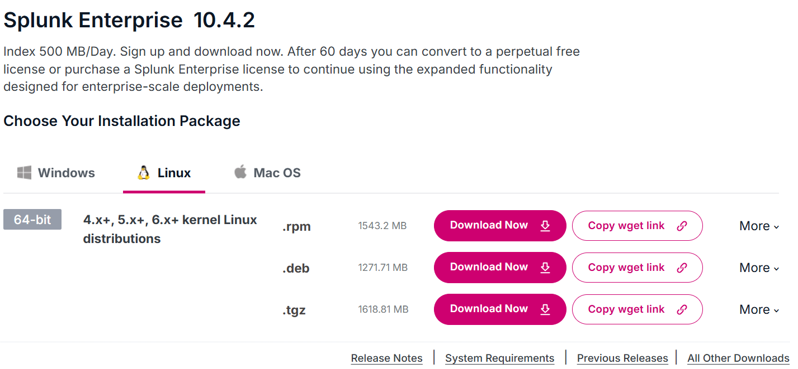

# SOC Lab — Splunk Installation & Log Source Setup

> **Prerequisite:** This assumes the VMware environment (VMs, networking) is already set up.
> See VMware setup documentation: [insert Drive link here]

## For this SOC lab build, here's the full machine list you need:

### Required VMS:

| VM | OS | Purpose	| Min Specs |
|---|---|---|---|
Splunk Server |	Ubuntu Server 24.04 LTS	SIEM | indexes and searches logs | 4GB RAM, 2 vCPU, 40GB disk |
Windows 10 | Windows 10 |	Victim/log source #1 | 3GB RAM, 2 vCPU, 30GB disk
Windows 11 | Windows 11	|Victim/log source #2 |	4GB RAM, 2 vCPU, 40+ disk (Win11 is heavier)
Kali | Kali Linux |	Attacker — runs simulated attacks |	2-4GB RAM, 2 vCPU, 40+GB disk |

I have already mentioned above the documentation for downloading and setting up all the VM machines. Please download that document and follow each step in it sequentially.

> **NOTE -** **One Windows victim machine is enough to complete** the Lab.   
>Running 4 VMs simultaneously needs meaningful host resources — as a rough guide, 16GB+ RAM on your host machine is recommended if running all 4 at once (Windows VMs especially are RAM-hungry). If your host has less, you can run them selectively (e.g., Splunk + Windows 10 + Kali together, turned off Windows 11 when not testing it).  

## Step-by-Step: Splunk Enterprise Installation on Ubuntu Server

### Step 1: Start and update the system

```bash
sudo apt update && sudo apt upgrade -y
```
### Step 2: Download Splunk Enterprise
 - Go to splunk official site and create free Splunk account to get the link.
 - Go to splunk.com/download → Splunk Enterprise → Linux → copy the .deb package wget link.
 - Paste your download link, Download using wget in ubuntu server.
    ```bash
    wget -O splunk.deb "https://download.splunk.com/products/splunk/releases/<version>/linux/splunk-<version>-linux-2.6-amd64.deb"
    ```
### Step 3: Install the package
```bash
sudo dpkg -i splunk.deb
```
### Step 4: Create a dedicated splunk user
```bash
sudo useradd -m splunk
sudo mkdir -p /opt/splunk/var/log/splunk
sudo chmod 755 /opt/splunk/var/log
sudo chown -R splunk:splunk /opt/splunk/var/log
```
### Step 5: Start Splunk for the first time (accept license, set username as admin & set your storng password)
```bash
sudo -u splunk /opt/splunk/bin/splunk start --accept-license

```
### Step 6: Enable Splunk at boot
```bash
sudo /opt/splunk/bin/splunk enable boot-start -user splunk
```
### Step 7: Open firewall ports
```bash 
sudo ufw allow 8000/tcp    # Web UI
sudo ufw allow 8089/tcp    # Management port
sudo ufw allow 9997/tcp    # Forwarder receiving port
sudo ufw enable 
sudo ufw status  
``` 


### Step 8: Access the web UI
- From your host machine browser: https://splunkserver-ip:8000

- Log in with admin/password you set in Step 5.


### Step 9: Enable receiving & Verify Splunk is running
```bash
sudo /opt/splunk/bin/splunk enable listen 9997 -auth admin:YourStrongPassword123
sudo /opt/splunk/bin/splunk status      # verify
```

## Step-by-Step: Splunk Universal Forwarder on windows 10/11
Do this on each windows VM (10 and 11)

### Step 1: Download Sysmon
- Get it from Microsoft Sysinternals: https://learn.microsoft.com/sysinternals/downloads/sysmon
 
- Extract the ZIP to a folder, e.g., C:\Tools\Sysmon\

### Step 2: Download a Sysmon config
- Use the well-known SwiftOnSecurity config (good starter, low noise):
https://github.com/SwiftOnSecurity/sysmon-config → download **sysmonconfig-export.xml** Save it in the same C:\Tools\Sysmon\ folder.

### Step 3: Install Sysmon with the config
- Open PowerShell as Administrator:
    ```bash 
    cd C:\Tools\Sysmon
    .\Sysmon64.exe -accepteula -i sysmonconfig-export.xml
    ```
### Step 4: Verify Sysmon is logging
- Open Event Viewer → Applications and Services Logs → Microsoft → Windows → Sysmon → Operational
- You should see events flowing (Event ID 1 = process creation, etc.)

### Step 5: Download Splunk Universal Forwarder
- On the Windows VM, go to splunk.com/download (scroll the page) → Universal Forwarder (login if they ask) → Download 64 bit Windows 10/11 .msi


### Step 6: Install the Universal Forwarder
- Run the .msi 
- **License agreement:** accept
- **Choose install type:** "On-premises"
- **Local admin credentials:** set a username/password for the forwarder service
- **Deployment server:** leave blank ( Skip)
- **Receiving indexer:** enter your Splunk server's IP and port 9997. e.g., 192.168.x.x:9997
- Finish install
### Step 7: Configure inputs.conf
- **Navigate to:**
    > C:\Program Files\SplunkUniversalForwarder\etc\system\local
- Create a new file inputs.conf with:
    ```ini
    [WinEventLog://Security]
    disabled = 0
    index = windows_logs

    [WinEventLog://System]
    disabled = 0
    index = windows_logs

    [WinEventLog://Application]
    disabled = 0
    index = windows_logs

    [WinEventLog://Microsoft-Windows-Sysmon/Operational]
    disabled = 0
    index = windows_logs
    renderXml = true
    ```
### Step 8: Restart the forwarder service 
- Run powershell as Administrator:
    ```powershell
    net stop SplunkForwarder
    net start SplunkForwarder
    ```
### Step 9: Verify connectivity to Splunk server
```powershell
Test-NetConnection -ComputerName <splunk-server-ip> -Port 9997
```
**TcpTestSucceeded : True** means the forwarder can reach Splunk server.

### Step 10: Confirm data is arriving in Splunk
Back on your Splunk web UI, run:
```spl
index=windows_logs host=<windows-vm-hostname>
```
You should start seeing Security, System, Application, and Sysmon events.

---
**One important thing first — make sure windows_logs index exists**

Since your inputs.conf references *index=windows_logs*, create that index in Splunk before starting the forwarder, or events will fail to index:

1. Splunk web UI → Settings → Indexes → New Index
2. Name: windows_logs
3. Save