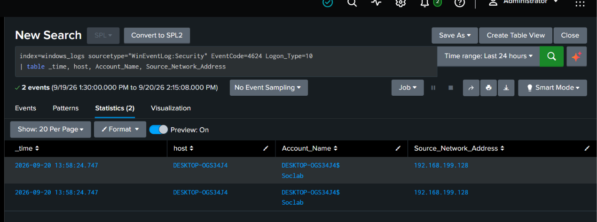

# Scenario 1: Brute Force Access & Persistence
## Scenario Overview
Simulated an external attacker brute-forcing RDP access into a Windows 10 endpoint using Hydra from a Kali attacker machine, followed by establishing persistence by creating a new local user account with administrator privileges. This mirrors a common real-world intrusion pattern where exposed RDP services are brute-forced and attackers add new accounts to maintain long-term access.

## Attack Narrative
On **2026-09-20 at 14:02 UTC**, a simulated attacker from a Kali Linux machine (192.168.199.128) attempted to gain unauthorized access to a Windows 10 endpoint (WIN10-VICTIM, 192.168.199.131) by brute-forcing RDP credentials. After successfully logging in with the compromised account labtest, the attacker established persistence by creating a new privileged account backupadmin. This mirrors real-world ransomware and intrusion campaigns where attackers brute-force exposed RDP services and then create hidden accounts for long-term access.
## Environment
- **Attacker machine**: Kali Linux - 192.168.199.128
- **Target machine:** Windows 10 - 192.168.199.131
- **SIEM:** Splunk server - 192.168.199.138

## Attack Simulation
**Step1 - Recon:Confirm RDP is exposed**
```bash
nmap -p 3389 -sV 192.168.199.131
```
Output:


**Step 2 - Build Wordlists**

userlist.txt: 
```
administrator
soclab
```
passwd.txt :
```
Password123
Summer2024!
admin123
```
Note: wordlist is intentionally small and lab-controlled to keep the simulation fast and repeatable; real-world brute force campaigns typically use lists with thousands to millions of entries.

**Step 3 - Run Hydra brute force**
```bash
hydra -L userlist.txt -P passwd.txt rdp://192.168.199.131 -t 4
```
Output:
```
[3389][rdp] host: 192.168.199.131   login: soclab   password: admin123
1 of 1 target successfully completed, 1 valid password found
```


**Step 4 - Confirm access via RDP**
```bash
xfreerdp /u:soclab /p:'admin123' /v:192.168.199.131
```
Successfully established an interactive RDP session, confirming the credential was valid and usable - not just a password match, but actual account takeover.

Output:


**Step 5 - Establish persistence (new account creation)**

From within the RDP session, attacker run powershell as administrators creates a new account and adds it to Administrators:
```Powershell
net user backupadmin P@ssw0rd! /add
net localgroup Administrators backupadmin /add
```
Output:


Now the attacker can login their backupadmin account using RDP Session.

## Detections
### Detection 1 - Brute Force Attempts

**Log Source:** Windows Security Event ID 4625 (Failed Logon)
```spl
index=windows_logs sourcetype="WinEventLog:Security" EventCode=4625
| stats count by Account_Name, Source_Network_Address
| where count > 5
```
**Result:** Query returned `soclab` with 6 failed attempts from `192.168.199.128` within a 1-minute window - clearly anomalous compared to typical login failure patterns (real users rarely fail 6 times in under a minute).

**screenshots:**


### Detection 2 - Successful Logon Following Failures (higher-value detection)
```spl
index=windows_logs sourcetype="WinEventLog:Security" EventCode=4624 Logon_Type=10
| table _time, host, Account_Name, Source_Network_Address
```
**Result:** Confirmed a successful RDP logon (Logon_Type=10) for soclab from 192.168.199.128 at 13:58:24.

**Screenshots:**


**Why this matters more than Detection 1 alone:** Failed logon attempts alone only indicate an attempt - this query confirms successful compromise.

### Detection 3 - Correlation Query (attempted + successful, tied together)
```spl
index=windows_logs sourcetype="WinEventLog:Security" (EventCode=4625 OR EventCode=4624)
| transaction Source_Network_Address maxspan=5m
| search EventCode=4625 EventCode=4624
| table _time, host, Account_Name, Source_Network_Address, EventCode
```
This single query identifies the full attack pattern - a burst of failures followed by a success from the same source within a 5-minute window.

**Screenshots:**


### Detection 4 - Persistence via New Account Creation
**Log Source:** Windows Security Event ID 4720 (A user account was created) and Event ID 4732 (A member was added to a security-enabled local group)
```spl
index=windows_logs sourcetype="WinEventLog:Security" (EventCode=4720 OR EventCode=4732)
| table _time, host, Account_Name, Target_Account, EventCode
```
**Result:** Detected creation of backupadmin and addition to Administrators group.

**Screenshots:**


## Severity
**High** - successful brute force combined with persistence indicates a completed compromise with attacker intent to maintain long-term access, not just a failed/blocked attempt.

## MITRE ATT&CK Mapping
| Stage |Technique  | ID |
|---|---|---|
|Credential Access |	Brute Force: Password Guessing | T1110.001 |
|Persistence | Create Account |	T1136.001 | 

## Response Actions
1. Block source IP 192.168.199.128 at the firewall/network level
2. Disable the `soclab` account immediately and force a password reset on any related accounts.
3. Remove the `backupadmin` account from Administrators group and delete it immediately.
4. Review all activity performed during the RDP session (process creation logs, file access) to determine attacker actions beyond persistence.
5. Check for additional persistence mechanisms (scheduled tasks, services, other Run keys) that may have been added.
6. If this were a real incident: recommend disabling direct RDP exposure to the internet and requiring VPN + MFA for remote access going forward.

## Learning Outcomes
- Hydra cracked the weak password quickly - highlights the risk of exposed RDP with weak credentials.
- Correlation queries (failures + success) are more valuable than isolated detections.
- Persistence via account creation is stealthy and common - attackers often prefer this method on Windows.
- Worth testing detection against other persistence methods (scheduled tasks, services, registry keys) for broader coverage.